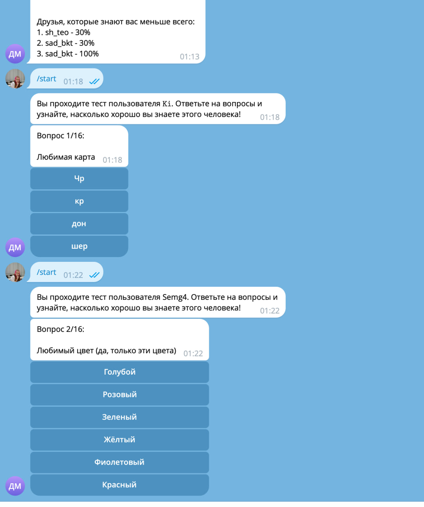

Бот, в котором:
1. можно загрузить json с вопросами и вариантами ответов
2. можно пройти тест самому и скинуть ссылку друзьям. они могут пройти тест, насколько хорошо они знают вас. вам придёт результат, сколько процентов набрали и где как ответили, а им придёт просто результат
3. есть команды /top и /stats


## развернуть
1. заполнить токен в .env, получить его через бота @BotFather
2. установить зависимости
```bash
uv sync
```
3. запустить
```bash
python src/main.py
```

## логика
1. база пишется в sqlite.db файлик, докера не предполагается